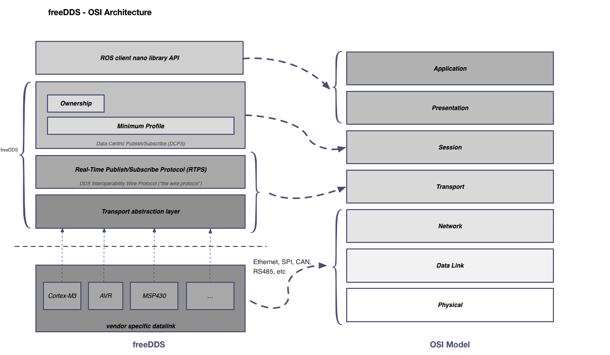

# Architecture

### freeDDS Architecture

Put a picture of freeDDS with comments informing what exactly should each layer implement

###DDS - OSI comparison
Let's see how the layers proposed for our embedded DDS, freeDDS, match with the OSI architecture:

