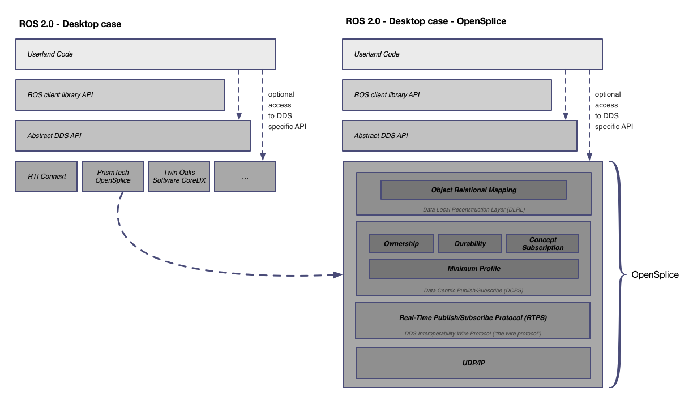

# ROS 2

ROS 2 is the next generation of the Robot Operative System framework. ROS 2 has been design with a whole new range of applications in mind:

>- Teams of multiple robots: while it is possible to build multi-robot systems using ROS today, there is no standard approach, and they are all somewhat of a hack on top of the single-master structure of ROS.
- Small embedded platforms: we want small computers, including “bare-metal” microcontrollers, to be first-class participants in the ROS environment, instead of being segregated from ROS by a device driver.
- Real-time systems: we want to support real-time control directly in ROS, including inter-process and inter-machine communication (assuming appropriate operating system and/or hardware support).
- Non-ideal networks: we want ROS to behave as well as is possible when network connectivity degrades due to loss and/or delay, from poor-quality WiFi to ground-to-space communication links.
- Production environments: while it is vital that ROS continue to be the platform of choice in the research lab, we want to ensure that ROS-based lab prototypes can evolve into ROS-based products suitable for use in real-world applications.
- Prescribed patterns for building and structuring systems: while we will maintain the underlying flexibility that is the hallmark of ROS, we want to provide clear patterns and supporting tools for features such as life cycle management and static configurations for deployment.
>
>Taken from http://design.ros2.org/articles/why_ros2.html

ROS 2 uses DDS systems as the middleware and in Desktop systems, the code can be structured as:

We can select a specific DDS vendor (e.g.: OpenSplice) and picture the overall architecture again:

### ROS 2 and nanoDDS

This kind of architecture is intractable for embedded systems where resources are limited thereby a new approach is proposed:

With this approach, both Desktop and embedded systems will be able to communicate through the RPTS protocol:

