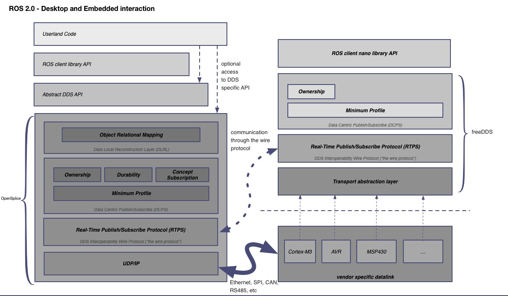

# ROS 2

ROS 2 is the next generation of the Robot Operative System framework. ROS 2 has been design with a whole new range of applications in mind:

>- Teams of multiple robots: while it is possible to build multi-robot systems using ROS today, there is no standard approach, and they are all somewhat of a hack on top of the single-master structure of ROS.
- Small embedded platforms: we want small computers, including “bare-metal” microcontrollers, to be first-class participants in the ROS environment, instead of being segregated from ROS by a device driver.
- Real-time systems: we want to support real-time control directly in ROS, including inter-process and inter-machine communication (assuming appropriate operating system and/or hardware support).
- Non-ideal networks: we want ROS to behave as well as is possible when network connectivity degrades due to loss and/or delay, from poor-quality WiFi to ground-to-space communication links.
- Production environments: while it is vital that ROS continue to be the platform of choice in the research lab, we want to ensure that ROS-based lab prototypes can evolve into ROS-based products suitable for use in real-world applications.
- Prescribed patterns for building and structuring systems: while we will maintain the underlying flexibility that is the hallmark of ROS, we want to provide clear patterns and supporting tools for features such as life cycle management and static configurations for deployment.
>
>Taken from http://design.ros2.org/articles/why_ros2.html

### ROS 2 in Desktop

ROS 2 uses DDS systems as the middleware and in Desktop systems, the code can be structured as:

We can select a specific DDS vendor (e.g.: OpenSplice) and picture the overall architecture again:

In a nutshell, the _Data Centric Publish/Subscribe Layer_ is a middleware that allows applications to communicate through topics using the Publisher/Subscriber paradigm. The _Data Local Reconstruction Layer_ automatically updates events locally from the remote updates and allows the application to access events "as if" they were local.

As the picture shows, the DDS is divided in several modules, each one representing one or more _profiles_. According to the OMG-DDS specification, a coherent set of profiles are defined that target real-time information-availability for domains ranging from small-scale embedded control systems up to large-scale enterprise information management systems.

Each DDS-profile adds distinct capabilities that define the service-levels offered by DDS. According to PrismTech documentation on OpenSplice:

>- **Minimum Profile** - this basic profile utilizes the well known publish/subscribe paradigm to implement highly efficient information dissemination between multiple publishers and subscribers that share interest in so called 'topics'. Topics are the basic data structures expressed in the OMG's IDL language (allowing for automatic generation of typed 'Readers' and 'Writers' of those 'topics' for any mix of languages desired). This profile also includes the QoS framework that allows OpenSplice DDS C Tutorial1 Introduction to OpenSplice DDS the middleware to 'match' requested and offered Quality of Service parameters
(the minimum profile offering basic QoS attributes such as 'reliability', 'ordering' or 'urgency').
- **Ownership Profile** - this 'replication' profile offers support for replicated publishers of the same information by allowing a 'strength' to be expressed by each publisher so that only the 'highest strength' information will be made available to interested parties.
- **Content Subscription Profile** - this 'content awareness' profile offers powerful features to express fine grained interest in specific information content (content filters). This profile also allows applications to specify projection views and aggregation of data as well as dynamic queries for subscribed 'topics' by utilizing a subset of the well known SQL language whilst preserving the real-time
requirements for the information access.
- **Persistence Profile** - this 'durability' profile offers transparent and fault tolerant availability of 'non volatile' data that may either represent persistent 'settings' (to be stored on mass media throughout the distributed system) or 'state' preserved in a fault tolerant manner outside the scope of transient publishers (allowing late joining applications and dynamic reallocation).
- **DLRL Profile** - this 'object model' (Data Local Reconstruction Layer) extends the previous four data centric DCPS profiles with an object-oriented view on a set of related topics thus providing typical OO features such as navigation, inheritance and use of value types.
>
>Taken from OpenSplice DDS Version 6.x C Tutorial Guide

### ROS 2 in the embedded world

The previous architecture is intractable for embedded systems where resources are limited thereby a new approach for this kind of devices should be designed. The architecture should contain the RTPS protocol (_the wire protocol_) and also at least the _Minimum_ and _Ownership_ profiles from the _Data Centric Publish/Subscribe Layer_.

Such a system is modelled in the following diagram:

_Minimum_ and _Ownership_ profiles should provide realtime publish/subsription messaging:
- Asynchronous _one-to-many_ realtime data communication
- Dynamic data-flow based on _current interest_ (topic subscription/publishing)
- Platform Independent Data Model (IDL)
- Strong typed interfaces
- Information ownership management for replicated publishers

With this approach, both Desktop and embedded systems will be able to communicate through the RPTS protocol:

